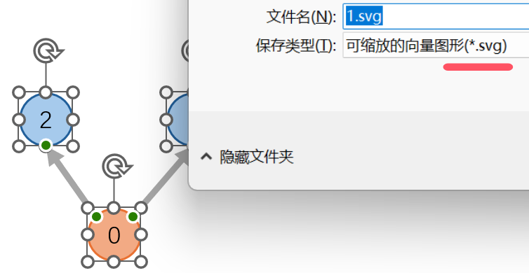

# svg2pdf.py
A naive python script to convert SVG to PDF.


This script converts all SVG files in a directory to PDF files.


Reference: https://stackoverflow.com/a/5835909

# Install

Dependencies:
```
pip install svglib reportlab
```


# Workflow of drawing paper illustrations using PowerPoint

1. Draw an illustration using PowerPoint.


2. Select the illustration, right click and Save as SVG image.



3. Use this script to convert SVGs to PDFs.
```
python svg2pdf.py
```

4. Using PDFs as figure in LaTex.
```
\begin{figure}[htbp] 
    \centering
    \includegraphics[width=0.3\linewidth]{1.pdf}
    \caption{1}
    \label{fig:enter-label}
\end{figure}
```
